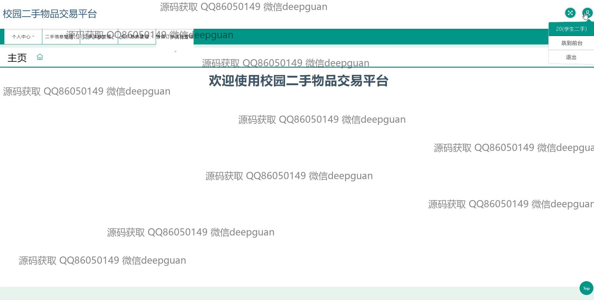
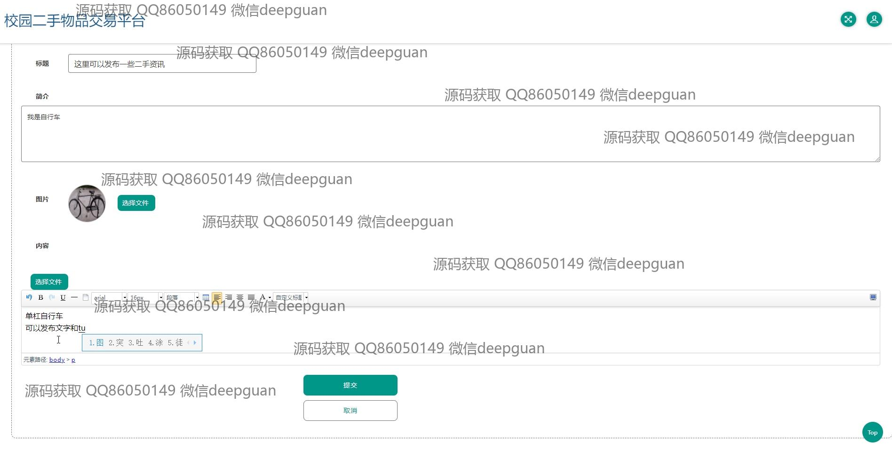
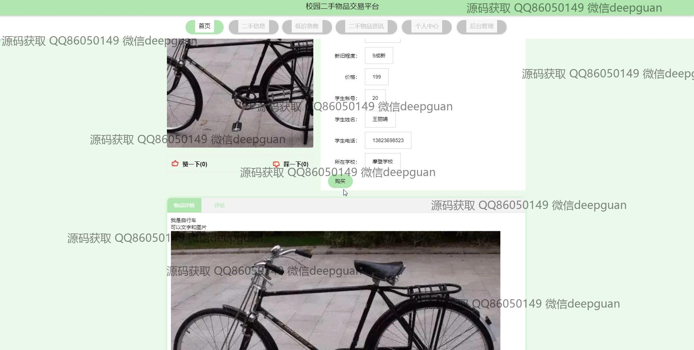

<h1 align="center">基于java的校园二手物品交易平台的设计与实现+jsp</h1>

## 简介
校园二手物品交易平台：角色分为管理员、用户；支持个人信息管理、二手物品交易、订单处理、物品分类管理、评论管理与低价急售发布功能，提供便捷的学生间物品交易服务。    --计算机毕业设计源码；毕设源码；java毕业设计源码

## 联系方式

<h3 align="center">获取完整代码与数据库文件 + 微信：deepguan QQ: 86050149 QQ群: 783742310</h3>

<h3 align="center">可帮忙远程部署 包运行成功！提供远程部署、修改代码、设计文档指导、代码讲解等服务！</h3>

## 功能介绍（完整见运行截图）
管理员：管理员可以通过管理界面实现对学生和二手物品的信息管理，包括用户信息编辑、物品类型管理、轮播图管理和二手物品资讯管理等功能。页面提供了查看、修改和删除功能以便于维护数据的准确性。此外，管理员能够管理付款流程，确认订单信息，处理订单审核和急售项目相关事务。学生：学生能够在交易平台上注册账户，填写相关个人信息如学号、姓名、联系方式等。注册成功后，可以利用个人中心查看和修改个人信息，发布或编辑自有的二手物品信息。在进行交易时，学生可以上传商品照片，描述物品详情，并与潜在买家进行评论互动。用户还可以对商品进行编辑，查看二手评论，并进行点赞或购物。交易：平台提供完整的二手物品交易流程，从商品信息的发布、查询到订单生成和支付。用户可以通过首页的导航栏访问低价急售、商品类型筛选和物品详情等功能模块，快速定位感兴趣的商品。支付界面支持微信、支付宝等多种支付方式，保证交易的便捷完成。评论：用户可以在二手物品的详细页面撰写和回复评论，通过评价系统对商品进行描述和打分，反馈交易体验。评论功能支持编辑和撤回操作，并有导航栏辅助用户在不同信息模块间切换，提升用户与平台的互动性。

## 运行截图

本代码来源于网络,仅供学习参考使用!

